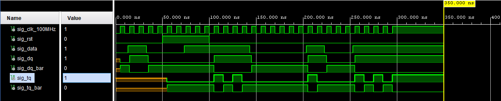

# Lab 5: INSERT_YOUR_FIRSTNAME INSERT_YOUR_LASTNAME

### D & T Flip-flops

1. Screenshot with simulated time waveforms. Try to simulate both D- and T-type flip-flops in a single testbench with a maximum duration of 350 ns, including reset. Always display all inputs and outputs (display the inputs at the top of the image, the outputs below them) at the appropriate time scale!

   

### JK Flip-flop

1. Listing of VHDL architecture for JK-type flip-flop. Always use syntax highlighting, meaningful comments, and follow VHDL guidelines:

```vhdl
----------------------------------------------------------------------------------
-- Company: 
-- Engineer: 
-- 
-- Create Date: 03/08/2023 12:35:47 PM
-- Design Name: 
-- Module Name: jk_ff_rst - Behavioral
-- Project Name: 
-- Target Devices: 
-- Tool Versions: 
-- Description: 
-- 
-- Dependencies: 
-- 
-- Revision:
-- Revision 0.01 - File Created
-- Additional Comments:
-- 
----------------------------------------------------------------------------------


library IEEE;
use IEEE.STD_LOGIC_1164.ALL;

-- Uncomment the following library declaration if using
-- arithmetic functions with Signed or Unsigned values
--use IEEE.NUMERIC_STD.ALL;

-- Uncomment the following library declaration if instantiating
-- any Xilinx leaf cells in this code.
--library UNISIM;
--use UNISIM.VComponents.all;

entity jk_ff_rst is
    Port ( clk : in STD_LOGIC;
           rst : in STD_LOGIC;
           j : in STD_LOGIC;
           k : in STD_LOGIC;
           q : out STD_LOGIC;
           q_bar : out STD_LOGIC);
end jk_ff_rst;

architecture behavioral of jk_ff_rst is

    signal sig_q : std_logic;
begin

    p_t_ff_rst : process (clk)
    begin
        if rising_edge(clk) then
        
            if (rst = '1') then         -- High-active reset
                sig_q <= '0';
            else
                if (j = '1' and k = '1') then
                    sig_q <= not(sig_q);
                else
                    sig_q <= j;
                    sig_q <= k;
                end if;
            end if;
            
        end if;
    end process p_t_ff_rst;

    -- Output ports are permanently connected to local signal
    q     <= sig_q;
    q_bar <= not sig_q;
    
end architecture behavioral;

```

### Shift register

1. Image of `top` level schematic of the 4-bit shift register. Use four D-type flip-flops and connect them properly. The image can be drawn on a computer or by hand. Always name all inputs, outputs, components and internal signals!

   